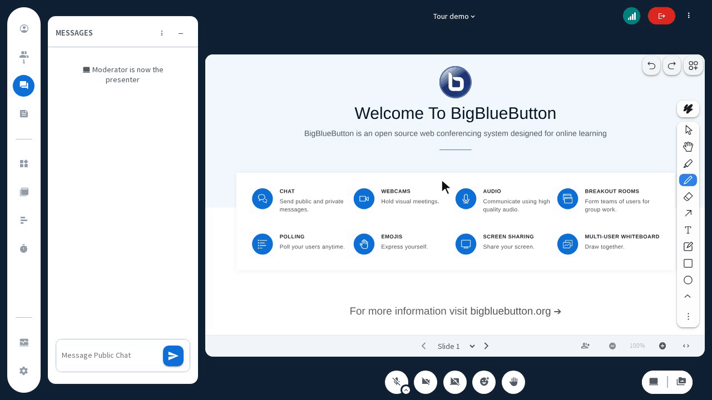

# Tour Plugin

## Description

The Tour plugin adds a button in the options dropdown menu that starts an in-meeting guided tour of key BigBlueButton features. It uses the [Shepherd.js](https://github.com/shepherd-pro/shepherd) library to highlight UI elements and display step-by-step instructions.



You can configure “Learn more” links that appear in specific steps (for example: screenshare, whiteboard, and a general help step) via the plugin settings.

### Features

#### Participant View (All Users)

- **Tour entry point**: A “Tour” button in the options dropdown menu inside the HTML5 client.
- **Step-by-step guidance**: A guided sequence that walks users through selected BigBlueButton features.
- **Contextual highlights**: Uses Shepherd.js to highlight relevant interface elements during each step.
- **Optional “Learn more” links**: Certain steps can display a link that opens additional documentation or help resources in a new browser tab.
- **Non-blocking**: The tour can be skipped or closed at any time without affecting the meeting.

#### Configuration (Admins / Integrators)

- **Per-feature links**: Configure separate URLs for screensharing, whiteboard, and general information.
- **Runtime configuration via `settings.yml`**: All URLs are set in the HTML5 client configuration, so you can point users to your own documentation or LMS pages.
- **Branch-per-version model**: Branching strategy aligned with BigBlueButton core and SDK versions (see **Plugin Versioning** below).

Example `settings.yml` configuration:

```yaml
public:
  plugins:
    - name: TourPlugin
      settings:
        url:
          screenshare: "https://some.url.with.more.information"
          whiteboard: "https://some.url.with.more.information"
          general: "https://some.url.with.more.information"
````

## Plugin Versioning

We maintain a dedicated branch of this plugin for each supported SDK version. This ensures that everything merged into a branch is compatible with the corresponding version of the BigBlueButton core.

| Repository Branch | Plugin-SDK Version | BigBlueButton Core Version |
| ----------------- | ------------------ | -------------------------- |
| v0.0.x            | v0.0.x             | v3.0.x                     |
| v0.1.x            | v0.1.x             | v3.1.x                     |

Always choose the branch that matches the SDK version used by your BigBlueButton deployment.

## Building the Plugin

To build the plugin for production use, run:

```bash
# From repository root (e.g. bbb-plugin-tour/)
npm ci
npm run build-bundle
```

This will generate a `dist` directory containing the production build. A typical output may look like:

```text
dist/
├── locales/
│   └── en.json
|   └── ...
├── manifest.json
├── TourPlugin.js
└── TourPlugin.js.LICENSE.txt
```

These files can be hosted on any HTTPS server.

If you host the JavaScript bundle separately from the manifest, remember to update the `javascriptEntrypointUrl` in `manifest.json` to the correct URL of `TourPlugin.js`.

### Using the Plugin in BigBlueButton

To use the plugin in BigBlueButton, include the manifest URL in the `create` API call:

```text
pluginManifests=[{"url":"https://<your-domain>/path/to/manifest.json"}]
```

Alternatively, you can add the same configuration to `bbb-web` so it is automatically applied to meetings created via the web application. In `/etc/bigbluebutton/bbb-web.properties`:

```properties
bbb.plugin.manifests=[{"url":"https://<your-domain>/path/to/manifest.json"}]
```

(Adjust the property name and syntax to match your current BigBlueButton version and plugin configuration conventions.)

## Development mode

For development (running this plugin from source inside the BigBlueButton HTML5 client), please refer to the
[BigBlueButton HTML Plugin SDK](https://github.com/bigbluebutton/bigbluebutton-html-plugin-sdk),
specifically the section **“Running the Plugin from Source”**.

That documentation covers:

* How to link a plugin repository into the BigBlueButton HTML5 client.
* How to configure the client to load the plugin in development mode.
* Recommended Node.js versions and development workflows.

## Production readiness

### Localization

* The plugin is designed to support external locale files (for example, via `dist/locales/`).
* Only a handful of languages are supported (compared to the languages that the HTML5 client supports)

### Test coverage

* TODO: add automated tests (unit and/or integration) for:

  * Rendering the tour button.
  * Running through the full tour sequence.
  * Handling missing or invalid “Learn more” URLs.

### Automation

* TODO: document any CI workflows (e.g. GitHub Actions) used for:

  * Running tests.
  * Building artifacts and attaching them to releases.

### Compatibility with BigBlueButton versions

* BigBlueButton 3.0.x: use branch `v0.0.x` (SDK v0.0.x).
* BigBlueButton 3.1.x: use branch `v0.1.x` (SDK v0.1.x).
* For newer versions, check this repository’s branches and release notes.

## Deployment

### Configuration

1. **Host plugin assets**

   Host the contents of `dist/` on an HTTPS server reachable by your BigBlueButton HTML5 client (it can be the same host as BigBlueButton).

2. **Register the manifest**

   * Either pass `pluginManifests` in each `create` API call, or
   * Configure `bbb-web` (`bbb-web.properties`) to always include the Tour plugin manifest.

3. **Configure “Learn more” URLs**

   In the HTML5 client `settings.yml`:

   ```yaml
   public:
     plugins:
       - name: TourPlugin
         settings:
           url:
             screenshare: "https://your.docs/screenshare"
             whiteboard: "https://your.docs/whiteboard"
             general: "https://your.docs/tour-overview"
   ```

### Nginx and networking

The Tour Plugin is delivered as static assets (JavaScript + manifest + locales) and does not introduce any new HTTP endpoints on the server side. In most deployments you only need:

* A standard HTTPS virtual host serving the plugin files.
* CORS and CSP rules that allow the HTML5 client to load the plugin bundle and manifest.

If you are already serving other plugin bundles, you can typically reuse that same configuration and just add `TourPlugin.js` and `manifest.json` under the same path.

## Security considerations

The Tour Plugin runs entirely in the browser and does not upload or store any additional user-generated files. Main areas to consider:

### External links in “Learn more”

* Only configure trusted HTTPS URLs for the `screenshare`, `whiteboard`, and `general` help links.
* Ensure that any external documentation pages follow your organization’s privacy and security standards.

### Permissions and roles

* The tour button is visible inside the HTML5 client UI. The walkthrough differs depending on which client functionality (menus, buttons) are visible, which depends on the role of the user. The presenter tour includes more steps currently as more controls are displayed.

### Data flow

* The plugin does not add new network endpoints; 
* No additional personal data is transmitted beyond what is already handled by BigBlueButton for a normal meeting session.

## File management

The Tour Plugin does **not** store files on the server (there are no uploads or additional assets created at runtime). All assets are:

* Static build artifacts under `dist/`, deployed by an administrator.
* Loaded into the client as JavaScript, manifest, and locale files.

There is no server-side cleanup required beyond your normal deployment and release management processes.

## Personal Data Processing Questions

Because the Tour Plugin only displays an in-client walkthrough and optional documentation links, it does not introduce new categories of personal data beyond what BigBlueButton already processes.

When completing your organization’s DPIA or privacy assessments, you can generally document:

* **Data collection**: No additional personal data collected specifically by this plugin; it operates on the existing BigBlueButton session context.
* **Purpose**: To help users discover and understand built-in BigBlueButton features via an in-client tour.
* **Lawful basis**: Same as the lawful basis you use for providing access to BigBlueButton (for example, contract or legitimate interests in an educational context).

For any organization-specific GDPR, FERPA, or children’s data questions, reuse your existing BigBlueButton answers and note that this plugin is purely an interface aid (no extra storage, no external processing).

## Impact on recordings

* The Tour Plugin does not create new recording streams or assets.
* Guided tour overlays are part of the live UI only; they are not stored as separate recording resources.
* Recordings will behave as in a standard BigBlueButton session; any visible overlay at the time of recording is captured like any other client-side UI element.

## Dependencies

* **BigBlueButton HTML Plugin SDK** (matching the `Plugin-SDK Version` in the table above).
* **Node.js and npm** for building the plugin (see the SDK documentation for the recommended versions; for example, Node 20.x).
* **Shepherd.js**: used internally by the plugin for rendering the guided tour; it is bundled into the production build.

For more information on what this plugin does and how it is wired internally, see the source code in this repository and the official BigBlueButton documentation.
